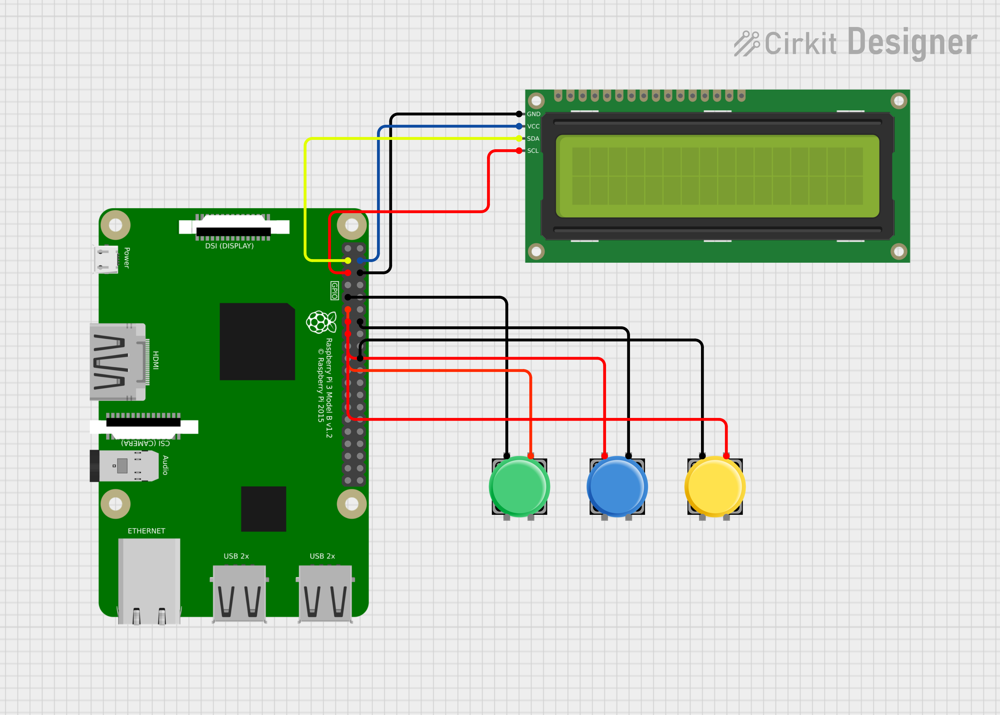

# F1 News & Race Ticker

This project is an F1 news and race results ticker built using a Raspberry Pi and a 16x2 I2C LCD Display. It fetches data from various APIs and RSS feeds to display real-time F1 news headlines, race results, and championship standings. The project allows users to interact with the display using three buttons for refreshing the feed, toggling features, and cycling through feeds.

## Features

-   **News Feed**: Fetches and displays the latest F1 news headlines from GPBlog.
-   **Race Results**: Shows the most recent race results using the Jolpica-F1 API.
-   **Driver Standings**: Displays the current F1 driver standings.
-   **Button Controls**: Three buttons allow for manual feed refresh, toggling features, and cycling between feeds.
-   **Smooth Scrolling**: Text longer than the display width scrolls smoothly for better readability.

## Hardware Requirements

-   **Raspberry Pi (any model)**
-   **16x2 I2C LCD Display Module**
-   **Three push buttons**
-   **Jumper wires and a breadboard**
## Wiring Diagram

## Setup and Installation

1.  **Connect the Hardware**:
    
    -   Connect the I2C LCD Display to the Raspberry Pi.
    -   Connect three buttons to GPIO pins (e.g., 17, 22, and another pin of your choice) and configure pull-up resistors.
2.  **Install Dependencies**:
    `sudo apt-get update`
`sudo apt-get install python3-pip`
   ` pip3 install RPLCD RPi.GPIO requests feedparser schedule` 
    
3.  **Run the Script**:
    
    `python3 f1_ticker.py` 
    

## Code Explanation

1.  **APIs Used**:
    
    -   **Jolpica-F1 API**: Fetches race results and driver standings.
    -   **GPBlog RSS Feed**: Provides the latest F1 news headlines.
   Check out the [Ergast Developer API](https://ergast.com/mrd/) and [GPBlog](https://www.gpblog.com/en) for more information.

2.  **Button Functionality**:
    
    -   **Refresh Button**: Clears the display and refreshes the current feed.
    -   **Toggle Button**: Toggles between different display features.
    -   **Cycle Button**: Manually cycles through News, Race Results, and Standings.
3.  **Main Loop**:
    
    -   Cycles through feeds, displaying each for 10 seconds.
    -   Implements smooth text scrolling for items longer than the display width.

## Usage

-   Press the **Refresh Button** to manually update the displayed feed.
-   Press the **Toggle Button** to switch between different display features.
-   Press the **Cycle Button** to navigate manually through News, Race Results, and Standings.
-   The data automatically refreshes and cycles through each feed every 10 seconds.

## Potential Improvements

-   **Add More Feeds**: Integrate more sources or provide additional racing statistics.
-   **Advanced Controls**: Use more buttons or a rotary encoder for enhanced interaction.
-   **Mobile App Integration**: Build a companion app to control the display settings remotely.

## Acknowledgments

-   **APIs and Data Sources**:
- [Ergast Developer API](https://ergast.com/mrd/)
 - [GPBlog](https://www.gpblog.com/en)

## License

This project is licensed under the MIT License. See the `LICENSE` file for more details.